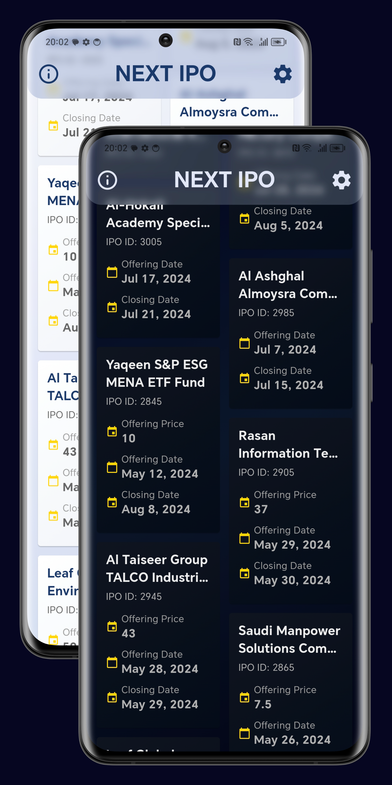

# NEXT IPO

NEXT IPO is a Flutter application designed to track and display information about upcoming Initial Public Offerings (IPOs). The app provides a user-friendly interface to view IPO details, customize settings, and stay updated on the latest offerings.

## Features

- **Dynamic IPO List**: View upcoming IPOs in an expandable card format.
- **Theme Support**: Choose between dark and light themes for comfortable viewing.
- **Customizable Settings**:
  - Select specific markets (All, Main Market, Nomu - Parallel Market, Sukuk)
  - Set custom date ranges for IPO listings
- **Multi-language Support**: Available in English and Arabic. (coming soon)
- **Responsive Design**: Utilizes a staggered grid layout for optimal viewing on various device sizes.
- **Real-time Data**: Fetches the latest IPO information and manages cookies for up-to-date listings.

## Screenshot

<p align="center" width="100%">

</p>

## Video Demonstration

We have created a video demonstration that showcases the app and how it works. 


<p align="center" width="100%">

</p>

[Link of the video](assets/NEXTIPOsVideo.mp4)


## How It Works

1. **Web Scraping**: 
   - The app uses web scraping techniques to fetch IPO data from the Saudi Exchange website.
   - It manages cookies and sends HTTP requests to retrieve up-to-date information.

2. **Data Processing**:
   - Retrieved IPO data is parsed and formatted for display.
   - The app handles various data fields such as company name, IPO ID, issue price, and offering dates.

3. **User Interface**:
   - IPOs are displayed in a staggered grid view with expandable cards.
   - The app supports both light and dark themes for user comfort.

4. **Customization**:
   - Users can customize market selection and date ranges for IPO listings through the settings page.

5. **State Management**:
   - Utilizes a combination of StatefulWidget and Provider for efficient updates and a responsive UI.

## Getting Started

### Prerequisites

- Flutter SDK 
- Dart 

### Installation

#### APK

[](assets/app-release.apk?raw=true)

#### From Source

1. Clone the repository:
   ```bash
   git clone https://github.com/FS-17/NEXT_IPOs.git
   ```

2. Navigate to the project directory:
   ```bash
   cd NEXT_IPOs
   ```

3. Install dependencies:
   ```bash
   flutter pub get
   ```

4. Run the app:
   ```bash
   flutter run
   ```

## Contributing

Contributions are welcome! Please feel free to submit a Pull Request.

## Disclaimer

This project is for educational purposes only. It is not intended for commercial use or as financial advice.

## License

Distributed under the MIT License. See `LICENSE` for more information.

## Acknowledgements

- [Flutter](https://flutter.dev/)
- [Dart](https://dart.dev/)
